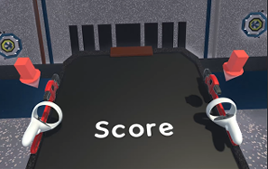
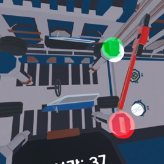

# My Little Ansan 사용자 기술문서
**My Little Ansan 사용자 기술문서**는 해당 프로젝트에 대한 조작법 및 진행 방법을 설명하는 문서입니다.
   

## 권장 플레이 대상

**추천 | 초등학교 저학년 어린이** 

My Little Ansan은 저학년 어린이들에게 쉽게 안산 산업을 체험할 수 있도록 계획되었습니다.   
다만 안산 산업을 체험하고자 하는 대상도 플레이할 수 있습니다.

## 기본 조작법
각 체험은 배경 설명 및 조작법을 전달한 이후 게임을 플레이하는 방식으로 진행됩니다.

 - 게임 내 버튼은 컨트롤러에 있는 Ray를 버튼으로 향한 후, **트리거 버튼**을 눌러 상호작용할 수 있습니다.
 - 물건은 컨트롤러에 있는 **그랩 버튼**을 눌러 들 수 있습니다.
 - 컨트롤러에 있는 **A / B / X / Y 버튼**을 클릭하면 게임을 일시 정지하며 메뉴창을 열 수 있습니다.
 - 게임을 진행할 위치에서 **조정 버튼**을 길게 클릭하여 게임 내 위치를 조정할 수 있습니다.
 - 각 체험 별 조작법은 배경 설명을 모두 마칠 경우 이미지와 함께 나타납니다.

---

## 타이틀 씬
 게임 실행 시 타이틀 씬에서 시작하게 됩니다.

1. [게임 시작] 버튼을 눌러 도시 디자인 씬으로 이동합니다.

---

## 도시 디자인 씬
 도시 디자인 씬에서 플레이어는 나만의 안산을 설계할 수 있습니다. 총 3가지 체험을 각각 마칠때 마다 도시 디자인 씬으로 돌아와 원하는 건물을 짓습니다.

 * 첫 시작 및 체험 이동
  1. 시작 시 게임에 대한 설명이 시작되며, [계속] 버튼을 눌러 대화를 진행합니다.
  2. 설명을 마친 후, 각 체험 버튼을 눌러 해당 체험으로 이동합니다.

 
 * 도시 건설
 1. 각 체험을 마칠 때마다 도시에 건물을 1개 지을 수 있습니다.
 2. 주변에 있는 건물을 하나 골라 **그랩 버튼**으로 들어서 파란색 구역에 놓으면 건물이 건설됩니다.
 3. 총 3번의 체험을 모두 마치고 도시 건설을 완료하면 게임이 종료됩니다.

---

## 자동차 산업 체험
자동차 산업 체험에서는 자동차를 조립하는 체험이 진행됩니다. 4방향에서 오는 자동차 부품을 들고 있는 렌치로 맞추면 자동차를 조립할 수 있습니다.

 
 * 플레이 방법
 1. 게임 시작 시 자동차 산업에 대한 설명을 진행합니다.
 2. 앞에 놓인 두 렌치에 컨트롤러를 갖다 댄 후 중지로 **그랩 버튼**을 눌러 렌치를 손에 들 수 있으며, 두 렌치를 모두 들면 게임이 시작됩니다.
 3. 4방향에서 다가오는 부품을 렌치로 hitbox 안에서 맞출 시 점수를 획득합니다.
 4. 총 20점을 획득하거나, 제한 시간 내에 10점 이상 획득하면 게임이 클리어되며, [클리어] 버튼을 눌러 도시 디자인 씬으로 돌아갑니다.
 5. 10점 미만을 획득하거나 다시 플레이하고 싶은 경우, 메뉴의 [체험 재시작] 버튼을 눌러 체험을 다시 시작할 수 있습니다.

---

## 전기전자 산업 체험
전기전자 산업 체험에서는 고장 난 PCB보드판을 수리하는 체험이 진행됩니다. 9개의 홈 중 무작위로 고장 난 부분이 나타나며, 들고 있는 인두기를 1초 이상 갖다 대면 수리할 수 있습니다.

 
 * 플레이 방법
 1. 게임 시작 시 전기전자 산업에 대한 설명을 진행합니다.
 2. PCB보드판에 무작위로 점등되는 부분에 인두기를 1초 이상 갖다 대 수리합니다.
 3. 총 15점을 획득하거나, 제한 시간 내에 5점 이상 획득하면 게임이 클리어되며, [클리어] 버튼을 눌러 도시 디자인 씬으로 돌아갑니다.
 4. 5점 미만을 획득하거나 다시 플레이하고 싶은 경우, 메뉴의 [체험 재시작] 버튼을 눌러 체험을 다시 시작할 수 있습니다.

---

## 섬유 산업 체험
섬유 산업 체험에서는 옷을 직접 색칠하여 완성하는 체험이 진행됩니다. 거대한 옷의 앞면에 페인트총을 쏘면 옷을 색칠할 수 있습니다.

 
 * 플레이 방법
 1. 게임 시작 시 섬유 산업에 대한 설명을 진행합니다.
 2. 오른손에 들고 있는 페인트 총을 조준하여 트리거 버튼을 누르면 페인트를 발사하며, 옷에 페인트가 닿으면 색칠됩니다.
 3. 주변에 있는 페인트통에 총을 담글 경우 해당 색으로 페인트 색이 변경됩니다.
 4. 제한 시간이 모두 지나면 자동으로 게임이 클리어되며, [클리어] 버튼을 눌러 도시 디자인 씬으로 돌아갑니다.
 5. 게임을 다시 플레이하고 싶은 경우, 메뉴의 [체험 재시작] 버튼을 눌러 체험을 다시 시작할 수 있습니다.

---

## 플레이 주의 사항
VR 기기를 사용하여 프로젝트를 실행 시 다음의 주의 사항을 확인해주세요.

  - VR 사용 시 충분한 공간을 확보해야 합니다.
       
  - 다음과 같은 문제가 발생할 경우, 충분한 휴식을 취하도록 합니다.
    1. 다음의 신체 부위에 불편감 또는 통증이 느껴지는 경우   
       └ 머리, 눈, 어깨, 목, 등, 가슴 등
    2. 멀미, 현기증, 어지러움 등이 느껴지는 경우
    3. 숨가쁨 또는 심장 두근거림이 느껴지는 경우
   
  - 어린 아이가 플레이하는 경우, 반드시 보호자의 감독이 필요합니다.
   
 자세한 내용은 Meta Quest 홈페이지에서 확인할 수 있습니다.   
 https://www.meta.com/kr/quest/safety-center/

---

## Reference
- Controller 이미지 https://www.meta.com/kr/quest/accessories/quest-2-controllers/

 
